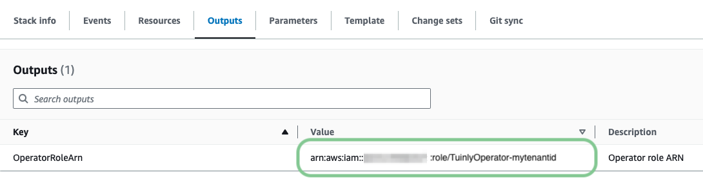

# Amazon Web Services (AWS)

Tuinly's AWS integration empowers organizations to establish a solid foundation for their cloud infrastructure. It starts by enabling self-service AWS landing zones, which provide a scalable and secure multi-account setup, tailored to your organizational needs. This ensures that you adhere to best practices right from the start of your cloud journey.

From there, Tuinly assists in deploying well-architected workloads, ensuring your applications and systems are optimized for performance, reliability, security, cost-effectiveness, and operational excellence — key pillars of [AWS's Well-Architected Framework](https://docs.aws.amazon.com/wellarchitected/latest/framework/welcome.html).

Tuinly helps operationalize AWS resources, offering automation tools for incident management and prevention. This ensures that potential issues are identified early and resolved efficiently, reducing downtime and keeping your AWS environment running smoothly. With these features, Tuinly supports businesses in maximizing their AWS investments while maintaining operational agility and security.

> Tuinly is designed to work with a model of operators, each representing a purpose-specific role - much like how your internal team might have a Database Administrator, Network Engineer, or DevOps Specialist. Instead of a single all-powerful role, you can provision multiple, scoped roles to grant Tuinly only the permissions needed to perform specific tasks on your behalf.

## Security Primer

In line with our best practices, credential sharing should be avoided whenever possible. Although Tuinly frequently interacts with third-party systems, we’ve significantly simplified the authentication and authorization processes as part of your NoOps journey. This is achieved through:

- [AWS Security Token Service (STS)](https://docs.aws.amazon.com/IAM/latest/UserGuide/id_credentials_temp.html), which grants trusted entities short-lived, least-privilege credentials, ensuring secure and temporary access.
- Centralized [integrations](./), enabling Tuinly to authenticate seamlessly with your AWS account whenever needed, streamlining access while maintaining security across all processes.

By leveraging these mechanisms, we ensure robust security without the operational burden of managing shared credentials.

## Configuration

### Prerequisites

- AWS account: For more detailed instructions on creating an AWS account, please refer to the [official AWS documentation](https://aws.amazon.com/resources/create-account/).
- Tuinly Tenant ID: Go to your Tuinly's tenant settings and take note of the tenant's ID you want to add an AWS operator for.

### Deploying an AWS operator

1. In the AWS Management Console, navigate to the CloudFormation service.

1. Click **Create Stack** and choose **With new resources (standard)**.

1. In the **Specify template** section provide the following Amazon S3 URL and proceed by clicking **Next**.

   ```
   https://s3.amazonaws.com/opsassets.tuinly.com/AdministratorAccess.json
   ```

   > **Important**: This template is provided as a quick-start example. It provisions an AdministratorAccess role to help you get up and running quickly by granting broad permissions to your AWS environment.
   >
   > Tuinly will never deploy or manage anything without your explicit consent. However, for most use cases, we strongly recommend transitioning to a model that uses purpose-specific operators—roles designed around real-world team responsibilities like DatabaseAdmin, NetworkAdmin, or OpsOperator.
   >
   > This operator-based model enables least-privilege access, giving Tuinly only the permissions needed for specific domains. It aligns closely with how access is typically segmented across roles in your own team.
   >
   > You’ll find a list of these operators [below](#operator-roles). If you'd like to start directly with purpose-specific roles or customize permissions, [reach out to us](https://urls.tuinly.com/contact) — we’re happy to help.

1. Enter a stack name (e.g. "TuinlyOperator") and provide your Tuinly tenant's ID as noted earlier.

1. Optional: Specify tags, permissions, and advanced options.

1. Review and Deploy: Review your configuration, acknowledge any required capabilities (e.g., IAM), and click **Create stack**.

1. After the deployment has finished, take note of the **OperatorRoleArn** value in the Outputs tab.
   
   _Figure 1: OperatorRoleArn in AWS CloudFormation Stack Outputs_

### Adding a new Tuinly AWS integration

1. Navigate to your Tuinly tenant's integrations overview.

1. Select **Configure** under AWS integrations.

1. Click **+ Add** to create a new integration.

1. Assign a friendly name to your integration. We recommend using a clear, unique name such as "AWS Root Account".

1. Enter the ARN of the operator created earlier in CloudFormation.

1. Finally, click **Create** to complete the integration setup.

Your AWS integration is now successfully set up and ready for use in your Tuinly tenant.

## Operator Roles

| Role            | Description                                                                    | Template URL                                                                     |
| --------------- | ------------------------------------------------------------------------------ | -------------------------------------------------------------------------------- |
| Database Admin  | Manages AWS database services including RDS and DynamoDB                       | `https://s3.amazonaws.com/operatortemplates.leanly.cloud/AwsDatabaseAdmin.json`  |
| DevOps Engineer | Manages platform resources such as ECS, EKS and Lambda functions               | `https://s3.amazonaws.com/operatortemplates.leanly.cloud/AwsDevOpsEngineer.json` |
| Network Admin   | Manages networking resources such as VPCs, subnets, route tables, and gateways | `https://s3.amazonaws.com/operatortemplates.leanly.cloud/AwsNetworkAdmin.json`   |
| AWS Admin       | Full administrative access to manage and operate all AWS resources             | `https://s3.amazonaws.com/opsassets.tuinly.com/AdministratorAccess.json`         |
